# Итоговая контрольная работа
## Задания:
**1. Используя команду cat в терминале операционной системы Linux, создать
два файла Домашние животные, заполнив файл собаками, кошками,
хомяками, и Вьючные животные, заполнив файл лошадьми, верблюдами и
ослами, а затем объединить их. Просмотреть содержимое созданного файла.
Переименовать файл, дав ему новое имя (Друзья человека).**

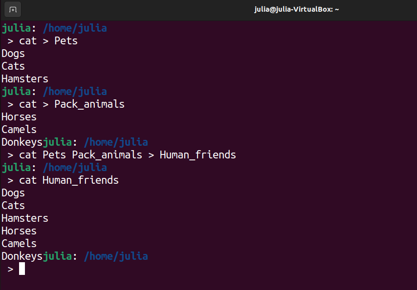

**2. Создать директорию, переместить файл туда.**

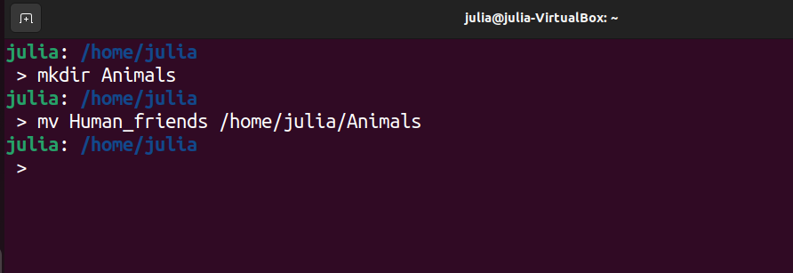

**3. Подключить дополнительный репозиторий MySQL. Установить любой пакет
из этого репозитория.**

Сначала добавим репозиторий MySQL APT в список репозиториев программного обеспечения нашей системы.

Переходим на страницу загрузки репозитория MySQL APT по адресу https://dev.mysql.com/downloads/.

Выбираем и загружаем пакет. Переходим в папку, где находится наш deb-пакет. 

`cd Downloads`

Устанавливаем загруженный пакет:

`sudo dpkg -i mysql-apt-config_0.8.29-1_all.deb`

Обновим информацию о пакете из репозитория MySQL APT:

`sudo apt-get update`

Устанавливаем MySQL:

`sudo apt-get install mysql-server`

Проверяем:

`systemctl status mysql`

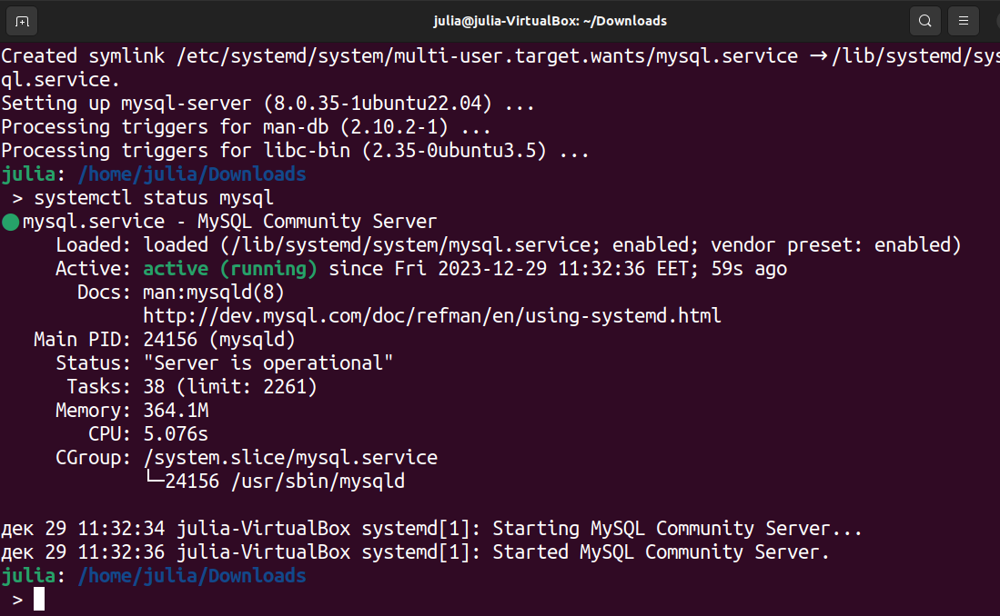

**4. Установить и удалить deb-пакет с помощью dpkg.**

Выбираем и загружаем пакет по адресу https://dev.mysql.com/downloads/.

Переходим в папку, где находится наш deb-пакет. 

`cd Downloads`

Устанавливаем загруженный пакет:

`sudo dpkg -i mysql-connector-python-py3_8.2.0-1ubuntu23.10_amd64.deb`

Теперь удалим загруженный пакет:

Так как удаление пакета с помощью dpkg (sudo dpkg -r) не удалит зависимости этого пакета, то будем использовать команду:

`sudo apt-get remove mysql-connector-python-py3`

**5. Выложить историю команд в терминале ubuntu.**

В терминале используем команду:

`history`

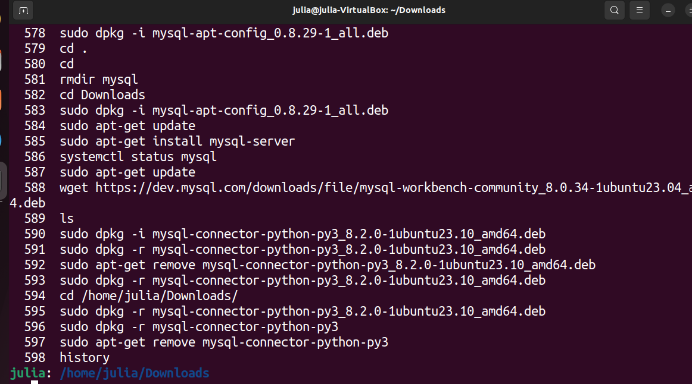

**6. Нарисовать диаграмму, в которой есть класс родительский класс, домашние
животные и вьючные животные, в составы которых в случае домашних
животных войдут классы: собаки, кошки, хомяки, а в класс вьючные животные
войдут: лошади, верблюды и ослы.**

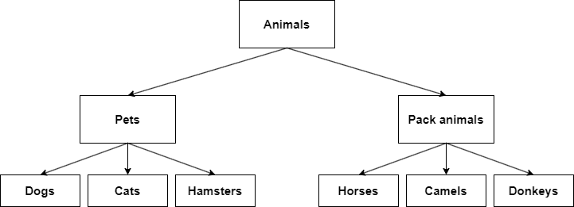

**7. В подключенном MySQL репозитории создать базу данных “Друзья
человека”.**

В терминале вводим:

`sudo mysql`

`CREATE DATABASE Human_friends;`

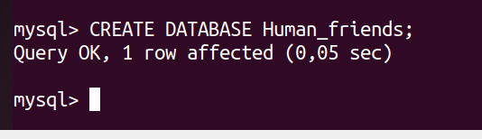

**8. Создать таблицы с иерархией из диаграммы в БД.**

`USE Human_friends;`

`CREATE TABLE animals (id INT PRIMARY KEY AUTO_INCREMENT, type_animal CHAR(15))`

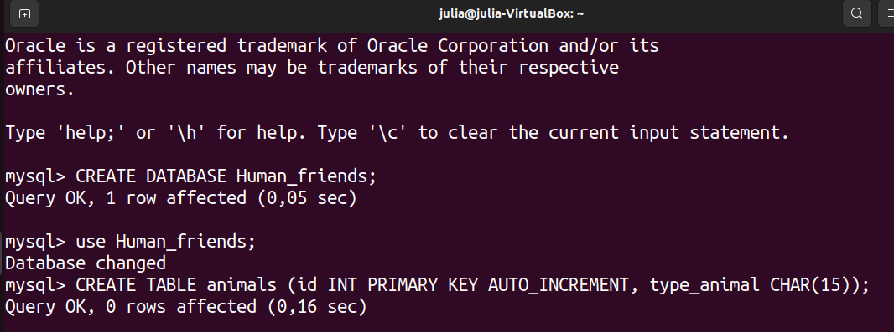

`CREATE TABLE pets (id INT PRIMARY KEY AUTO_INCREMENT, name_animal CHAR(15), animal_id INT, FOREIGN KEY (animal_id) REFERENCES animals(id));`

`CREATE TABLE pack_animals (id INT PRIMARY KEY AUTO_INCREMENT, name_animal CHAR(15), animal_id INT, FOREIGN KEY (animal_id) REFERENCES animals(id));`

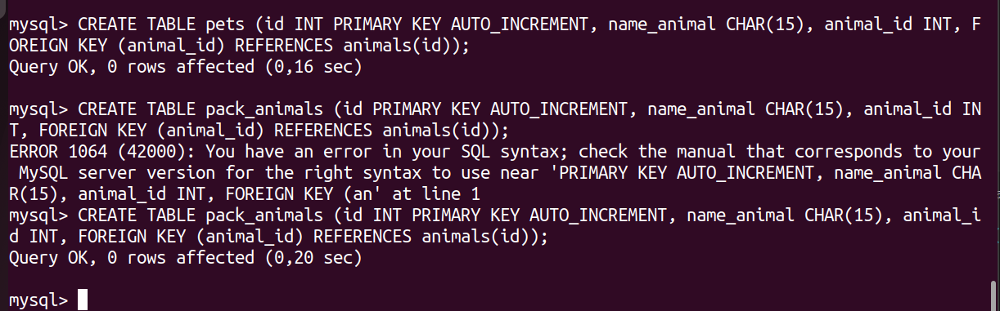

`CREATE TABLE cats (id SERIAL, nickname CHAR(15), birth_date DATE, command CHAR(20), animal_id INT, pets_id INT, FOREIGN KEY (animal_id) REFERENCES animals(id), FOREIGN KEY (pets_id) REFERENCES pets(id));`

`CREATE TABLE dogs (id SERIAL, nickname CHAR(15), birth_date DATE, command CHAR(20), animal_id INT, pets_id INT, FOREIGN KEY (animal_id) REFERENCES animals(id), FOREIGN KEY (pets_id) REFERENCES pets(id));`

`CREATE TABLE hamsters (id SERIAL, nickname CHAR(15), birth_date DATE, command CHAR(20), animal_id INT, pets_id INT, FOREIGN KEY (animal_id) REFERENCES animals(id), FOREIGN KEY (pets_id) REFERENCES pets(id));`

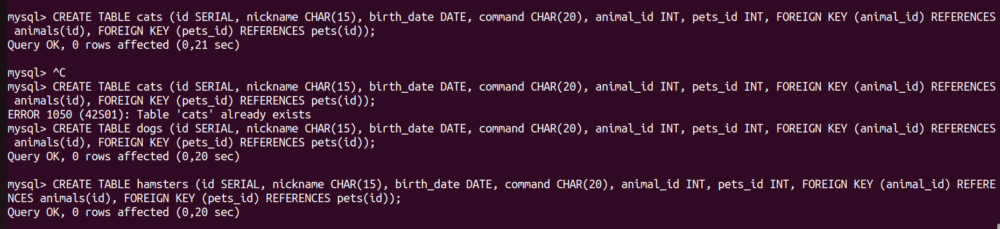

`CREATE TABLE horses (id SERIAL, nickname CHAR(15), birth_date DATE, command CHAR(20), animal_id INT, pack_animals_id INT, FOREIGN KEY (animal_id) REFERENCES animals(id), FOREIGN KEY (pack_animals_id) REFERENCES pack_animals(id));`

`CREATE TABLE camels (id SERIAL, nickname CHAR(15), birth_date DATE, command CHAR(20), animal_id INT, pack_animals_id INT, FOREIGN KEY (animal_id) REFERENCES animals(id), FOREIGN KEY (pack_animals_id) REFERENCES pack_animals(id));`

`CREATE TABLE donkeys (id SERIAL, nickname CHAR(15), birth_date DATE, command CHAR(20), animal_id INT, pack_animals_id INT, FOREIGN KEY (animal_id) REFERENCES animals(id), FOREIGN KEY (pack_animals_id) REFERENCES pack_animals(id));`

**9. Заполнить низкоуровневые таблицы именами(животных), командами
которые они выполняют и датами рождения.**

`INSERT INTO animals (id, type_animal) VALUES (1, "pets"), (2, "pack animals");`

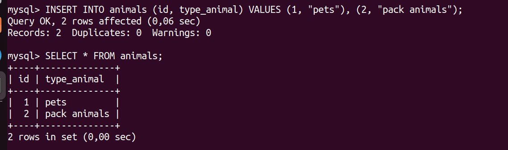

`INSERT INTO pets (id, name_animal, animal_id) VALUES (1, "cats", 1), (2, "dogs", 1), (3, "hamsters", 1);`

`INSERT INTO pack_animals (id, name_animal, animal_id) VALUES (1, "horses", 2), (2, "camels", 2), (3, "donkeys", 2);`

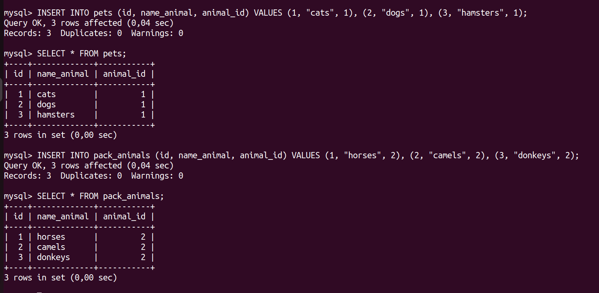

`INSERT INTO cats (id, nickname, birth_date, command, animal_id, pets_id) VALUES (1, "Monya", "2016-03-08", "sleep", 1, 1), (2, "Yosya", "2018-04-15", "eat", 1, 1);`

`INSERT INTO dogs (id, nickname, birth_date, command, animal_id, pets_id) VALUES (1, "Shsrik", "2020-06-11", "sit", 1, 2), (2, "Baron", "2017-12-17", "lie", 1, 2);`

`INSERT INTO hamsters (id, nickname, birth_date, command, animal_id, pets_id) VALUES (1, "Mouse", "2023-09-01", "nothing", 1, 3), (2, "Ben", "2022-12-28", "nothing", 1, 3);`

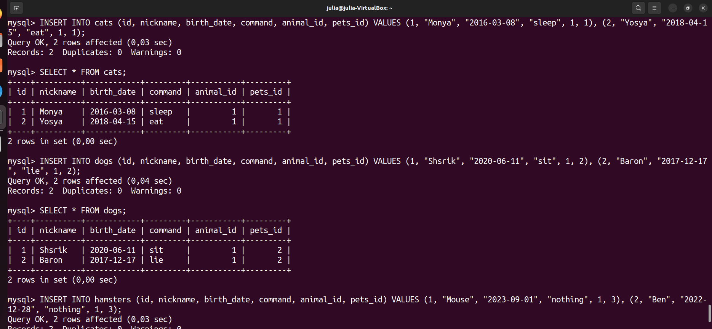

`INSERT INTO horses (id, nickname, birth_date, command, animal_id, pack_animals_id) VALUES (1, "Princess", "2020-02-23", "gallop", 2, 1), (2, "Snow", "2021-03-18", "to stand", 2, 1);`

`INSERT INTO camels (id, nickname, birth_date, command, animal_id, pack_animals_id) VALUES (1, "Vasya", "2021-08-12", "go/stop", 2, 2), (2, "Ali", "2022-09-02", "go/stop", 2, 2);`

`INSERT INTO donkeys (id, nickname, birth_date, command, animal_id, pack_animals_id) VALUES (1, "Iya", "2019-10-29", "go/stop", 2, 3), (2, "Tor", "2018-07-08", "go/stop", 2, 3);`

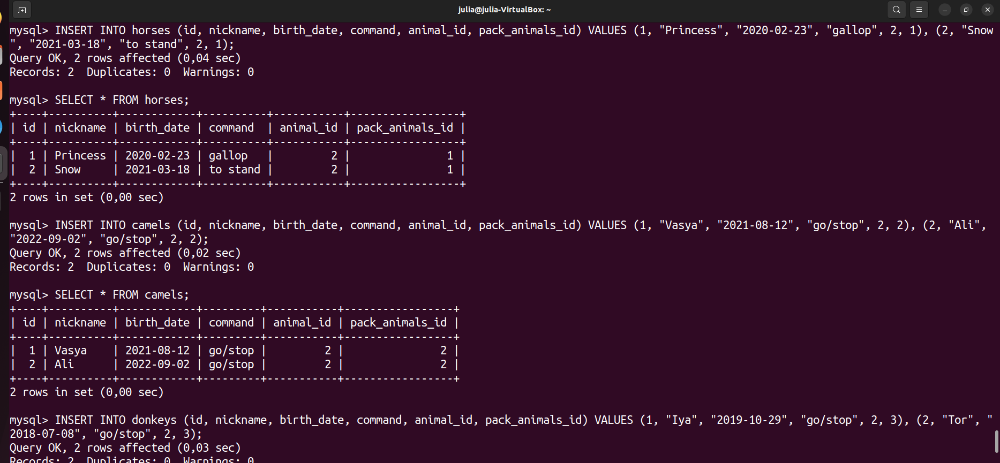

**10. Удалив из таблицы верблюдов, т.к. верблюдов решили перевезти в другой
питомник на зимовку. Объединить таблицы лошади, и ослы в одну таблицу.**

Было:

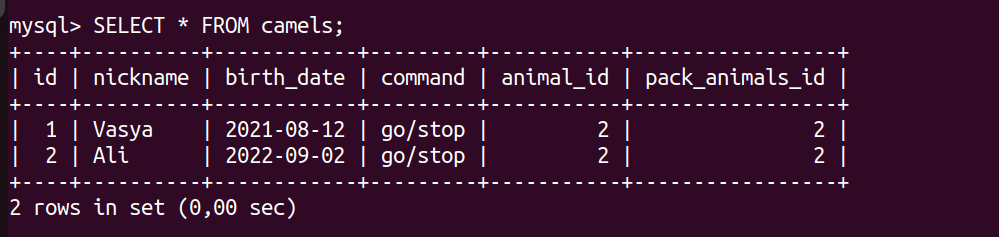

`TRUNCATE camels;`

`SELECT nickname, birth_date, command, animal_id, pack_animals_id FROM horses UNION SELECT nickname, birth_date, command, animal_id, pack_animals_id FROM donkeys;`

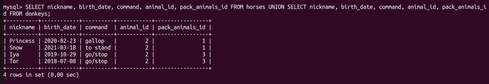

**11. Создать новую таблицу “молодые животные” в которую попадут все
животные старше 1 года, но младше 3 лет и в отдельном столбце с точностью
до месяца подсчитать возраст животных в новой таблице.**

`CREATE TABLE young_animals (id INT PRIMARY KEY AUTO_INCREMENT, nickname CHAR(15), birth_date DATE, command CHAR(20), age CHAR(50));`

`INSERT INTO young_animals (nickname, birth_date, command, age)`

`SELECT nickname, birth_date, command, CONCAT(FLOOR(DATEDIFF(CURDATE(), birth_date)/30.44), " months") AS age` 

`FROM (
    SELECT nickname, birth_date, command FROM cats WHERE birth_date >= DATE_SUB(CURDATE(), INTERVAL 3 YEAR) AND birth_date <= DATE_SUB(CURDATE(), INTERVAL 1 YEAR) 
    UNION ALL 
    SELECT nickname, birth_date, command FROM dogs WHERE birth_date >= DATE_SUB(CURDATE(), INTERVAL 3 YEAR) AND birth_date <= DATE_SUB(CURDATE(), INTERVAL 1 YEAR) 
    UNION ALL 
    SELECT nickname, birth_date, command FROM hamsters WHERE birth_date >= DATE_SUB(CURDATE(), INTERVAL 3 YEAR) AND birth_date <= DATE_SUB(CURDATE(), INTERVAL 1 YEAR) 
    UNION ALL 
    SELECT nickname, birth_date, command FROM horses WHERE birth_date >= DATE_SUB(CURDATE(), INTERVAL 3 YEAR) AND birth_date <= DATE_SUB(CURDATE(), INTERVAL 1 YEAR) 
    UNION ALL 
    SELECT nickname, birth_date, command FROM donkeys WHERE birth_date >= DATE_SUB(CURDATE(), INTERVAL 3 YEAR) AND birth_date <= DATE_SUB(CURDATE(), INTERVAL 1 YEAR)
    ) AS tmp;`

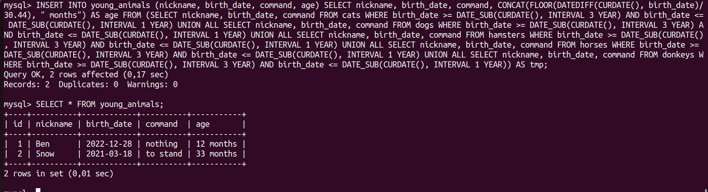

**12. Объединить все таблицы в одну, при этом сохраняя поля, указывающие на
прошлую принадлежность к старым таблицам.**

`CREATE TABLE all_animals (id INT PRIMARY KEY AUTO_INCREMENT, nickname CHAR(15), birth_date DATE, command CHAR(20), animal_id INT);`

`INSERT INTO all_animals (nickname, birth_date, command, animal_id)
SELECT nickname, birth_date, command, animal_id FROM cats;`

`INSERT INTO all_animals (nickname, birth_date, command, animal_id)
SELECT nickname, birth_date, command, animal_id FROM dogs;`

`INSERT INTO all_animals (nickname, birth_date, command, animal_id)
SELECT nickname, birth_date, command, animal_id FROM hamsters;`

`INSERT INTO all_animals (nickname, birth_date, command, animal_id)
SELECT nickname, birth_date, command, animal_id FROM horses;`

`INSERT INTO all_animals (nickname, birth_date, command, animal_id)
SELECT nickname, birth_date, command, animal_id FROM donkeys;`

`SELECT * FROM all_animals;`

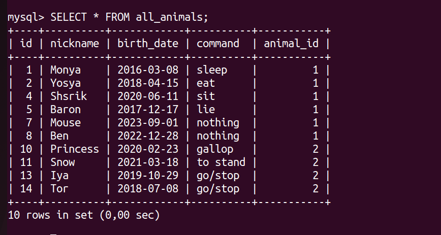

